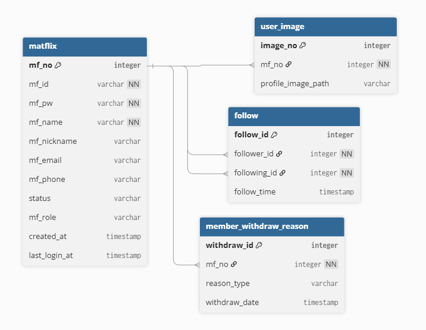
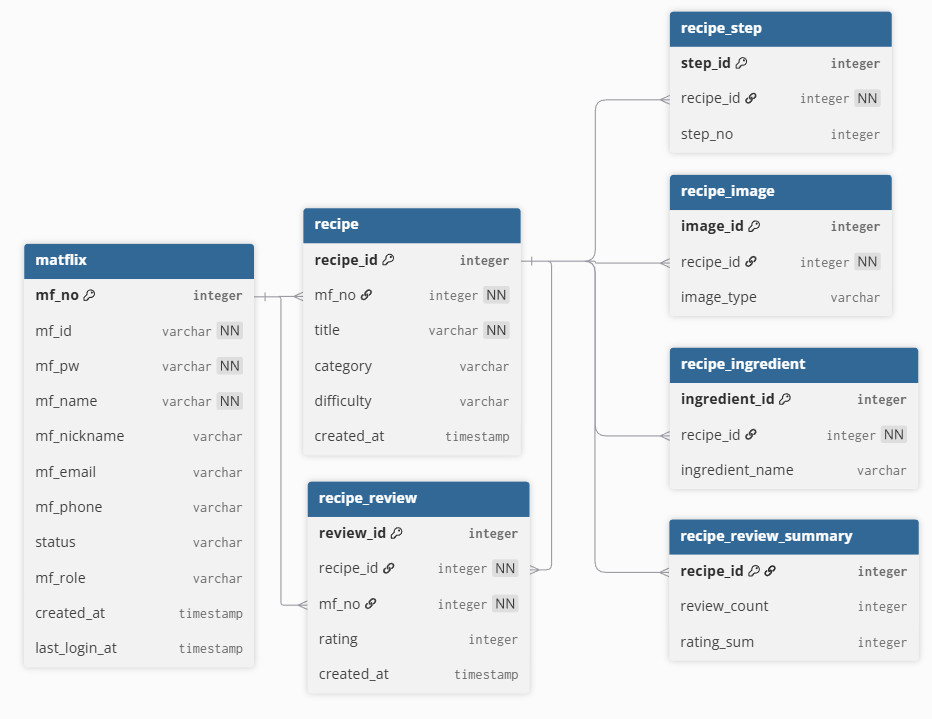
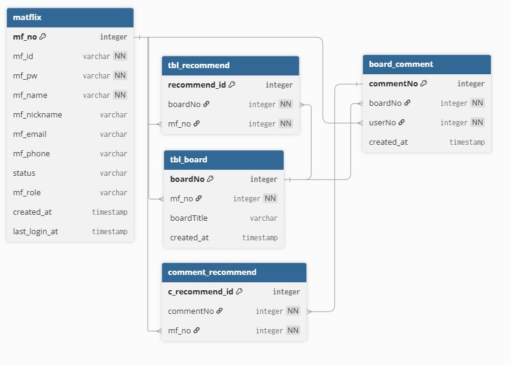
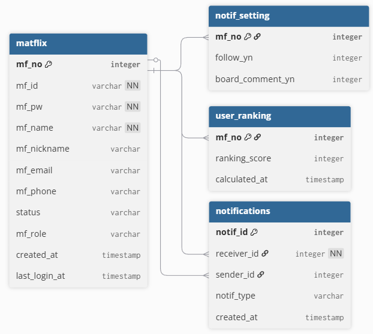

# MATFLIX

**MATFLIX**는 사용자가 레시피를 등록, 공유하고, 즐겨찾기 및 팔로우 기능을 통해 개인화된 요리 경험을 제공하는 웹 기반 레시피 플랫폼입니다.  

---

## 🌟 주요 기능(기여도: 상: ⭐/ 중: ★/ 하: ☆)

 ✅*개발 완료*

| 기능명 | 설명 | 기여도 |
|--------|------|--------|
| **레시피 CRUD 기능** | 사용자가 직접 레시피 등록, 수정, 삭제 가능 | 상 ⭐ |
| **리뷰 및 별점 기능** | 사용자 리뷰 등록/수정/삭제 및 레시피 별점 평균 표시 | 상 ⭐ |
| **레시피 신고 기능** | 부적절한 콘텐츠 신고 가능 | 상 ⭐ |
| **게시글 CRUD 기능** | 사용자가 직접 게시글 등록, 수정, 삭제 가능 | 상 ⭐ |
| **댓글 기능** | 레시피 및 게시글에 대한 사용자 댓글 작성, 수정, 삭제 가능 | 상 ⭐ |
| **즐겨찾기 기능** | 로그인 사용자 기반으로 레시피, 게시 즐겨찾기 및 마이페이지에서 관리 가능 | 상 ⭐ |
| **팔로우 기능** | 다른 사용자를 팔로우하여 최신 레시피 피드 확인 가능 | 상 ⭐ |
| **실시간 알림 기능** | 댓글, 팔로우, 추천 등 이벤트 발생 시 사용자에게 실시간 알림 제공 | 상 ⭐ |
| **마이페이지 기능** | 내 정보, 즐겨찾기, 내가 쓴 글/리뷰 등 개인화 정보 제공 | 상 ⭐ |
| **관리자 페이지 기능** | 로그인한 사용자 관리 가능 (밴/활성화, 온라인/오프라인 확인, 동시 접속 차단) | 상 ⭐ |
| **보안 기능** | 아이디는 쿠키 활용, 비밀번호는 BCrypt로 암호화 저장, 세션 관리, 동시 로그인 제한, 이메일 인증 | 상 ⭐ |

⏳*개발 예정* 
| 기능명 | 설명 |
|--------|------|
| **즐겨찾기 기능 강화** | 로그인 사용자 기반의 즐겨찾기 등록 및   마이페이지에서 관리 기능 제공 |
| **검색 기능** | 제목, 재료, 카테고리 기반 검색 기능 |
| **신고 기능** | 부적절한 레시피/댓글 신고 기능 및   관리자 페이지에서 신고 관리 가능 |
| **Elasticsearch/Redis 적용** | 검색 정확도 향상과 빠른 조회를 위한 캐싱 및 검색 기능 |
| **MongoDB 연동** | 향후 데이터 확장 및 분석용 데이터 저장 |

---

## 🛠 사용 기술 스택

- **Backend:** Java 17, Spring Boot, MyBatis  
- **Database:** MySQL  
- **Front-end:** HTML, CSS, JavaScript, jQuery, AJAX
- **실시간 알림 기능:** Server-Sent Events(SSE)
- **보안:** BCrypt, 세션 관리, 동시 로그인 제한, 이메일 인증 

---

## 📝 기능 상세 설명

### 🍳 레시피 CRUD
**사용자가 직접 레시피를 등록·수정·삭제할 수 있는 핵심 기능**

- 레시피 등록 / 수정 / 삭제 가능
- 대표 이미지 및 상세 정보 관리
- 카테고리, 재료, 조리 순서 구조화 저장

🔧 구현 포인트

- 이미지 업로드 시 서버 파일 시스템에 저장 후 DB에는 경로만 관리
- 수정 시 기존 이미지 삭제 여부를 판단하여 불필요한 파일 누적 방지
- DTO를 활용해 레시피 기본 정보와 이미지 정보를 분리 관리

---

### 📝 리뷰 및 ⭐ 별점
**레시피에 대한 사용자 평가 기능**

- 리뷰 작성 / 수정 / 삭제 가능
- 별점 등록 및 수정 가능
- 레시피 평균 별점 자동 계산 및 표시

🔧 구현 포인트

- 리뷰 CRUD와 별점 집계 로직 분리
- 리뷰 변경/삭제 시 평균 별점 즉시 반영
- 사용자 1명당 레시피 1개 리뷰 제한

---

### 🚨 레시피 신고
**부적절한 콘텐츠 관리를 위한 신고 기능**

- 신고 사유 선택 및 상세 내용 입력 가능
- 신고 데이터 DB 저장

🔧 현재 상태

- 신고 접수 기능 완료
- 관리자 페이지 내 신고 관리 탭 UI 구성 완료
- 처리 로직(승인 / 반려 / 제재)은 추후 확장 예정

---

### 📝 게시글 CRUD
**커뮤니티 게시판에서 사용자 간 소통을 위한 기능**

- 게시글 작성 / 수정 / 삭제 가능
- 레시피 질문, 팁 공유, 자유 게시글 지원

🔧 구현 포인트

- 작성자 본인만 수정/삭제 가능하도록 서버 단 권한 검증
- 페이징 처리로 게시글 수 증가 시에도 성능 유지

---

### 💬 댓글 기능
**레시피 및 게시글에 대한 사용자 피드백 기능**

- 댓글 작성 / 수정 / 삭제 가능
- 댓글 이벤트 발생 시 실시간 알림 연동

🔧 구현 포인트

- AJAX 기반 처리로 페이지 새로고침 없이 즉시 반영
- 작성자 검증을 통해 비정상 요청 차단

---

### ⭐ 즐겨찾기
**사용자가 관심 있는 콘텐츠를 저장하는 기능**

- 레시피 / 게시글 즐겨찾기 가능
- 마이페이지에서 즐겨찾기 목록 관리

🔧 구현 포인트

- 중복 즐겨찾기 방지 로직 적용
- 버튼 상태 즉시 변경으로 UX 개선

---

### 👥 팔로우
**사용자 간 관계 형성을 위한 기능**

- 다른 사용자 팔로우 / 언팔로우 가능
- 팔로우한 사용자의 레시피 및 게시글 피드 제공

🔧 구현 포인트

- 팔로우/언팔로우 AJAX 처리
- 중복 팔로우 방지
- 팔로우 이벤트 발생 시 실시간 알림 연동

---

### 🛎 실시간 알림
**사용자 행동에 즉각 반응하는 알림 시스템**

- 댓글, 팔로우, 추천 시 실시간 알림 제공
- 알림 버튼에서 내역 확인 가능

🔧 구현 포인트

- Server-Sent Events(SSE) 기반 실시간 통신
- 사용자별 알림 분리 전송

---

### 🛠 관리자 페이지
**서비스 운영을 위한 관리자 전용 관리 기능**

- 사용자 목록 조회 및 검색
- 사용자 상태 관리 (활성 / 밴)
- 온라인 / 오프라인 상태 확인

🔧 구현 포인트

- 관리자 권한 사용자만 접근 가능하도록 서버 단 권한 제어
- 사용자 상태를 색상 및 텍스트로 시각화하여 관리 편의성 강화
- 동일 계정 동시 로그인 감지 및 제어

---

### 🔐 보안 기능
**사용자 정보 보호 및 서비스 안정성을 위한 보안 설계**

- 비밀번호 BCrypt 해시 암호화 저장
- 세션 기반 로그인 인증 처리
- 이메일 인증을 통한 계정 활성화

🔧 구현 포인트

- 동일 계정 동시 로그인 제한으로 보안 및 운영 안정성 강화
- 서버 단 사용자 상태 검증으로 비정상 요청 차단
- 관리자에 의한 사용자 접근 제어 가능

---

## ERD

  
User ERD

   
  

  
Recipe ERD

   
  

  
Board ERD

   
  

  
Notification ERD

   
  

